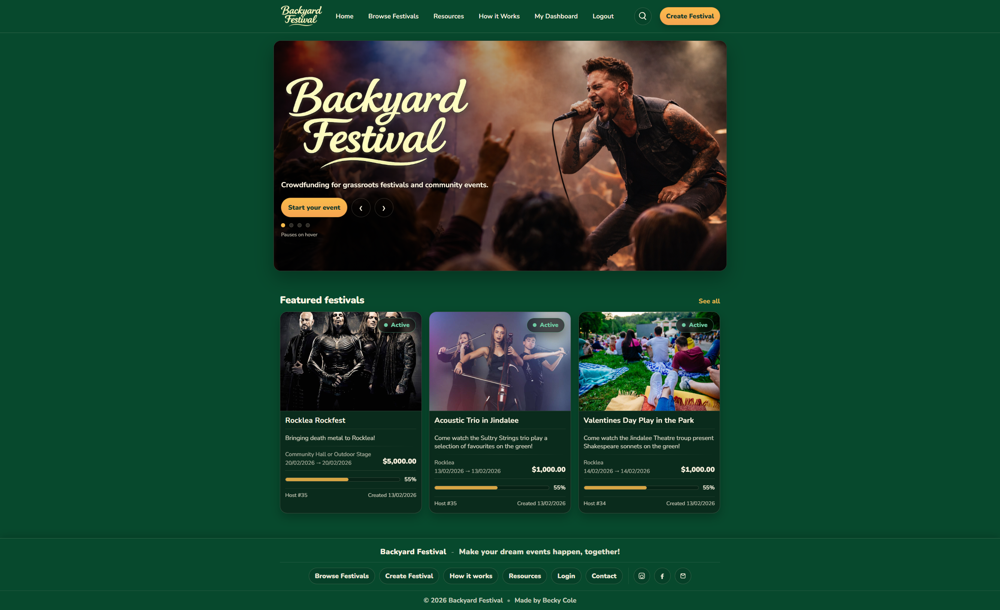
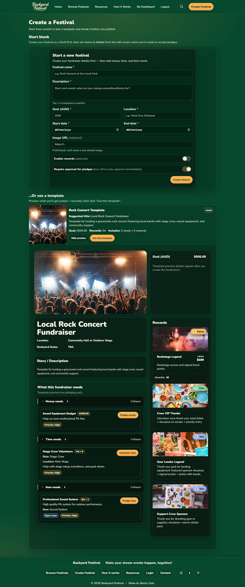
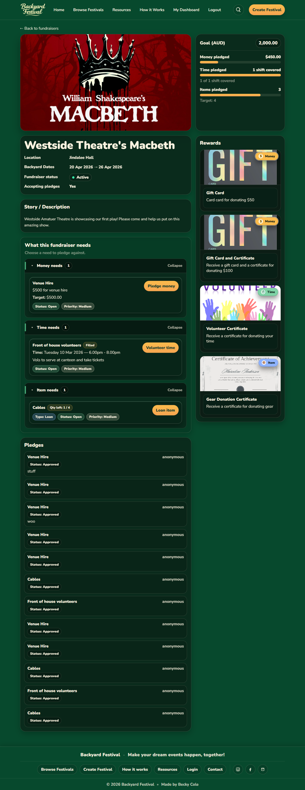

# React Project: Crowdfunding App (Part 2)<br><sub><sup><sub>Due: Last Sunday of the module at 11:59pm.</sub></sup></sub>

## Project Description
Kickstarter, Go Fund Me, Kiva, Change.org, Patreon… All of these different websites have something in common: they provide a platform for people to create fundraisers that they believe in, but they all have a slightly different approach. You are going to create your own crowdfunding website (this time the front-end), and put your own spin on it!

## Project Requirements
Here's a reminder of the required features. Your crowdfunding project must:

- [ ] Be separated into two distinct projects: an API built using the Django Rest Framework and a website built using React. 
- [ ] Have a cool name, bonus points if it includes a pun and/or missing vowels. See https://namelix.com/ for inspiration. <sup><sup>(Bonus Points are meaningless)</sup></sup>
- [ ] Have a clear target audience.
- [ ] Have user accounts. A user should have at least the following attributes:
  - [ ] Username
  - [ ] Email address
  - [ ] Password
- [ ] Ability to create a “fundraiser” to be crowdfunded which will include at least the following attributes:
  - [ ] Title
  - [ ] Owner (a user)
  - [ ] Description
  - [ ] Image
  - [ ] Target amount to raise
  - [ ] Whether it is currently open to accepting new supporters or not
  - [ ] When the fundraiser was created
- [ ] Ability to “pledge” to a fundraiser. A pledge should include at least the following attributes:
  - [ ] An amount
  - [ ] The fundraiser the pledge is for
  - [ ] The supporter/user (i.e. who created the pledge)
  - [ ] Whether the pledge is anonymous or not
  - [ ] A comment to go along with the pledge
- [ ] Implement suitable update/delete functionality, e.g. should a fundraiser owner be allowed to update its description?
- [ ] Implement suitable permissions, e.g. who is allowed to delete a pledge?
- [ ] Return the relevant status codes for both successful and unsuccessful requests to the API.
- [ ] Handle failed requests gracefully (e.g. you should have a custom 404 page rather than the default error page).
- [ ] Use Token Authentication, including an endpoint to obtain a token along with the current user's details.
- [ ] Implement responsive design.

## Additional Notes
No additional libraries or frameworks, other than what we use in class, are allowed unless approved by the Lead Mentor.

Note that while this is a crowdfunding website, actual money transactions are out of scope for this project.

## Submission
To submit, fill out [this Google form](https://forms.gle/34ymxgPhdT8YXDgF6), including a link to your Github repo. Your lead mentor will respond with any feedback they can offer, and you can approach the mentoring team if you would like help to make improvements based on this feedback!

Please include the following in your readme doc:
- [ ] A link to the deployed project.
- [ ] A screenshot of the homepage
- [ ] A screenshot of the fundraiser creation page
- [ ] A screenshot of the fundraiser creation form
- [ ] A screenshot of a fundraiser with pledges
- [ ] A screenshot of the resulting page when an unauthorized user attempts to edit a fundraiser (optional, depending on whether or not this functionality makes sense in your app!)


# Backyard Festival

Link: https://backyard-festival.netlify.app/

# Screenshots

# 🎪 Backyard Festival

**Live Site:** https://backyard-festival.netlify.app/  
**Frontend:** React (Vite)  
**Backend API:** Django REST Framework  

---

## 🌿 Overview

Backyard Festival is a full-stack crowdfunding platform designed for grassroots community events — backyard gigs, poetry slams, charity fundraisers, local festivals and creative initiatives.

Unlike traditional crowdfunding platforms that focus solely on financial pledges, Backyard Festival supports three pledge types:

- 💰 Money
- ⏰ Time (volunteering hours)
- 🎤 Items (equipment or supplies)

This allows organisers to crowdfund not just funding, but real community support.

---

## 🎯 Target Audience

- Community organisers  
- Musicians & artists  
- Grassroots event planners  
- Local charities  
- Creative collectives  

Backyard Festival is designed for scrappy, community-powered events that rely on collaboration rather than large financial backers.

---

## 🏗 Architecture

This project is separated into two distinct applications:

### Backend (Django REST Framework)
- RESTful API
- Token Authentication
- Permissions & role-based access control
- PostgreSQL (production)

### Frontend (React + Vite)
- React Router
- Custom responsive UI
- Role-based dashboard views
- Dynamic state updates
- Conditional rendering

---

## 🔐 Authentication

- Token Authentication implemented using Django REST Framework
- Users receive a token upon login
- Token stored in localStorage
- Authenticated endpoints require a valid token

---

## 👤 User Accounts

Users can:

- Register
- Log in
- Log out

Each user includes:

- Username
- Email
- Password (hashed)

---

## 🎪 Fundraisers

Users can create fundraisers with:

- Title
- Description
- Image
- Target amount
- Open / Closed status
- Created date
- Owner (User)

### Additional Fundraiser Features

- Draft status (not publicly visible)
- Active status (publicly visible)
- Toggle rewards on/off
- Toggle auto-approve pledges on/off
- Import reusable templates
- Auto-close when targets are reached

---

## 🧩 Templates

The Create Festival flow supports reusable templates.

Templates allow organisers to:

- Instantly populate a fundraiser with pre-configured needs
- Save time when setting up recurring event types
- Standardise event structures

---

## 🤝 Pledge System

Backyard Festival supports three pledge types:

### 💰 Money Pledges
- Amount
- Comment
- Anonymous option

### ⏰ Time Pledges
- Volunteer hours
- Comment
- Anonymous option

### 🎤 Item Pledges
- Quantity
- Comment
- Anonymous option

---

## 🔄 Pledge Workflow

Two approval pathways are supported:

### 1️⃣ Auto-Approve Mode
- Pledges are immediately counted
- Need countdown updates instantly
- Needs automatically close when filled

### 2️⃣ Manual Approval Mode
- Pledges enter a pending state
- Organiser must approve or decline
- Need progress updates after approval
- Needs close once approved pledges meet target

---

## 📊 Dynamic Features

- Live countdown of remaining items/hours/amount
- Needs automatically show as filled when targets are reached
- Rewards accumulate dynamically as pledges are made
- Dashboard updates instantly after pledge activity
- Role-based conditional rendering

---

## 🧑‍💼 Dashboard

The "My Dashboard" page changes based on user role.

### As a Supporter:
- View pledges made
- Track pledge status (pending / approved)
- View associated rewards

### As an Organiser:
- View owned fundraisers
- Approve or decline pledges
- Monitor need progress
- View reward tier accumulation

---

## 🔐 Permissions & Visibility

- Draft fundraisers are not publicly visible
- Only owners can edit or delete their fundraisers
- Only organisers can approve or decline pledges
- Unauthorized users receive proper 401/403 responses
- Custom 404 page implemented in React

---

## 📱 Responsive Design

- Mobile navigation (hamburger menu)
- Responsive fundraiser cards
- Responsive dashboard layout
- Adaptive grid system

---

## 📸 Screenshots

### Homepage


### Fundraiser Creation Page


### Fundraiser Form


### Fundraiser with Pledges


### Unauthorized Edit Attempt (Optional)


---

## 🚀 Running Locally

### Backend
```
python manage.py migrate
python manage.py runserver
```

### Frontend
```
npm install
npm run dev
```

---

## 🌟 Unique Value

Backyard Festival expands traditional crowdfunding by:

- Supporting money, time, and item pledges
- Providing flexible approval workflows
- Auto-closing needs dynamically
- Supporting reusable templates
- Providing role-based dashboards
- Dynamically accumulating reward tiers

---

## 🔮 Future Improvements

- Email notifications
- Advanced filtering & search
- Accessibility refinements
- Payment gateway integration (out of scope)

---

## 🎉 Reflection

Backyard Festival demonstrates:

- Full-stack architecture
- RESTful API design
- Complex relational modelling
- Role-based permissions
- Conditional UI rendering
- Responsive design implementation
- Real-world workflow logic
