# 🎪 Backyard Festival

**Live Site:** https://backyard-festival.netlify.app/  
**Frontend:** React (Vite)  
**Backend API:** Django REST Framework 
**Database:** PostgreSQL (production - Heroku)

---

## 🌿 Overview

Backyard Festival is a full-stack crowdfunding platform designed for grassroots, community-powered events. This includes backyard gigs, poetry slams, charity fundraisers, local festivals, and creative initiatives.

Unlike traditional crowdfunding platforms that focus solely on financial pledges, Backyard Festival supports three types of support:

- 💰 Money  
- ⏰ Time (volunteer hours)  
- 🎤 Items (equipment or supplies)

This allows organisers to crowdfund not just funding, but real community collaboration.

The platform reflects the reality that community events are powered by people, time, and shared resources, not just money.

---

## 🎯 Target Audience

Backyard Festival is built for:

- Community organisers  
- Independent musicians & artists  
- Grassroots event planners  
- Local charities  
- Creative collectives  
- Anyone running an event on a tight budget  

The platform is designed for scrappy, community-powered events that rely on collaboration rather than large financial backers.

---

## 🏗 Architecture

This project is separated into two distinct applications:

### Backend – Django REST Framework

- RESTful API design  
- Token authentication  
- Role-based permissions  
- Relational data modelling  
- Proper HTTP status codes for success and failure cases  
- PostgreSQL database (production)

### Frontend – React (Vite)

- React Router for multi-page navigation  
- Custom hooks for data fetching  
- Conditional rendering based on role & state  
- Real-time UI updates after pledge activity  
- Responsive mobile-first layout  

## Data Model Overview

The application is built around relational links between:

- Users
- Fundraisers
- Needs (Money, Time, Item)
- Pledges (Money, Time, Item)
- Reward Tiers

Each pledge links to a specific need, which allows precise progress tracking and approval-based accumulation logic.

---

## 🔐 Authentication

- Token authentication implemented using Django REST Framework  
- Custom endpoint returns both token and current user details  
- Token stored in `localStorage`  
- Authenticated endpoints require a valid token  
- Protected routes in React  

---

## 👤 User Accounts

Users can:

- Register  
- Log in  
- Log out  

Each user includes:

- Username  
- Email  
- Password (securely hashed)

Role-based UI rendering ensures different experiences for organisers and supporters.

---

## 🎪 Fundraisers

Authenticated users can create fundraisers including:

- Title  
- Description  
- Image  
- Target amount  
- Open / Closed status  
- Draft / Active visibility  
- Created date  
- Owner relationship  

### Additional Fundraiser Controls

- Draft status (not publicly visible)  
- Active status (publicly visible)  
- Toggle rewards on/off  
- Toggle auto-approve pledges on/off  
- Auto-close when targets are met  
- Import reusable templates  

---

## 🧩 Needs System (Core Feature)

Each fundraiser can contain structured “Needs”:

- 💰 Money Needs (target amount)  
- ⏰ Time Needs (required hours)  
- 🎤 Item Needs (quantity required)  

Each need tracks:

- Target value  
- Current pledged value  
- Remaining value  
- Filled status  

Needs automatically update based on pledge activity.

---

## 🤝 Pledge System

Backyard Festival supports three pledge types:

### 💰 Money Pledges
- Amount  
- Comment  
- Anonymous option  

### ⏰ Time Pledges
- Hours pledged  
- Comment  
- Anonymous option  

### 🎤 Item Pledges
- Quantity pledged  
- Comment  
- Anonymous option  

Each pledge is relationally linked to:

- A fundraiser  
- A specific need  
- A user  

---

## 🔄 Dual Approval Workflow

Backyard Festival includes two distinct pledge pathways:

### Auto-Approve Mode

- Pledges are immediately counted  
- Need totals update instantly  
- Needs automatically close when filled  

### Manual Approval Mode

- Pledges enter a pending state  
- Organiser must approve or decline  
- Only approved pledges count toward totals  
- Needs close once approved pledges meet target  

This workflow ensures flexibility for organisers while preserving data integrity.

---

## 🎁 Reward Tiers

If enabled, fundraisers can include dynamic reward tiers.

- Reward tiers are linked to needs  
- Rewards accumulate automatically as pledges are approved  
- Dashboard reflects reward progress instantly  
- Organisers can toggle rewards on or off  

---

## 🧑‍💼 Role-Based Dashboard

The “My Dashboard” page dynamically changes based on user role.

### As a Supporter

- View pledges made  
- Track pledge status (pending / approved / declined)  
- View associated rewards  
- See progress toward filled needs  

### As an Organiser

- View owned fundraisers  
- Approve or decline pledges  
- Monitor need progress  
- See real-time fulfilment status  
- Track reward tier accumulation  

---

## 🔐 Permissions & Security

- Draft fundraisers are not publicly visible  
- Only owners can edit or delete their fundraisers  
- Only organisers can approve or decline pledges  
- Unauthorized users receive proper 401/403 responses  
- Token required for protected endpoints  
- Custom 404 page implemented in React  

---

## 📊 Dynamic UI Behaviour

- Instant progress recalculation  
- Automatic “Filled” indicators  
- Conditional rendering based on approval state  
- Dashboard totals recalculate after pledge activity  
- Live remaining amount/hours/items display  
- Responsive mobile layout  

---

## 📱 Responsive Design

- Mobile hamburger navigation  
- Responsive dashboard grid  
- Responsive fundraiser cards  
- Adaptive layout for pledge management  

---

## 📸 Screenshots

### Homepage  


## Create Account
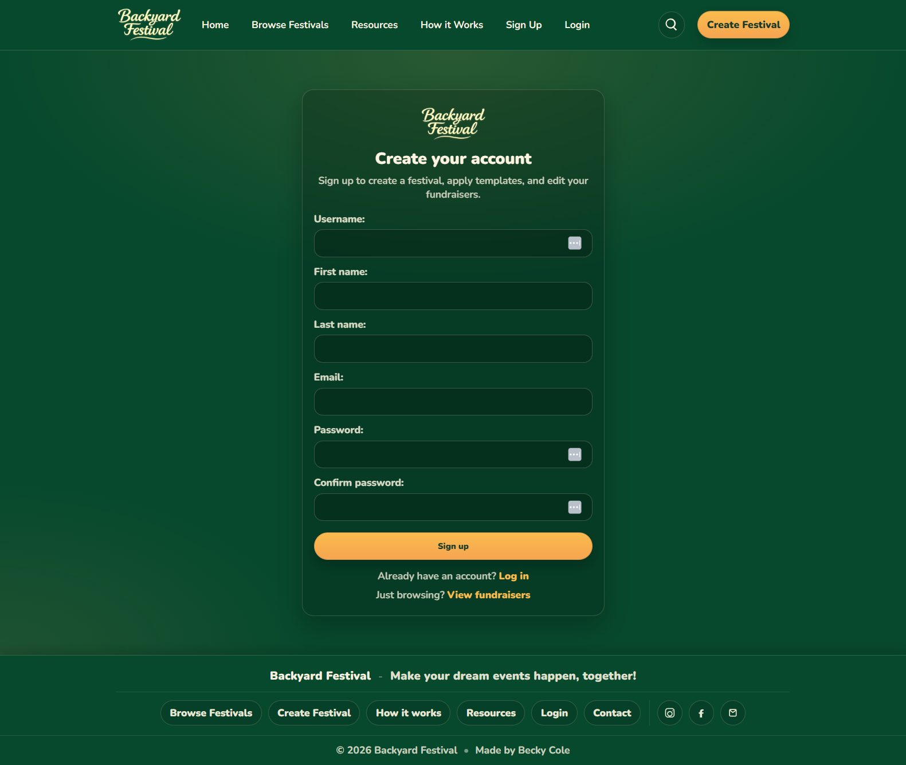

### Create Festival Form and Page with Additional Template Function


### Browse Festivals 
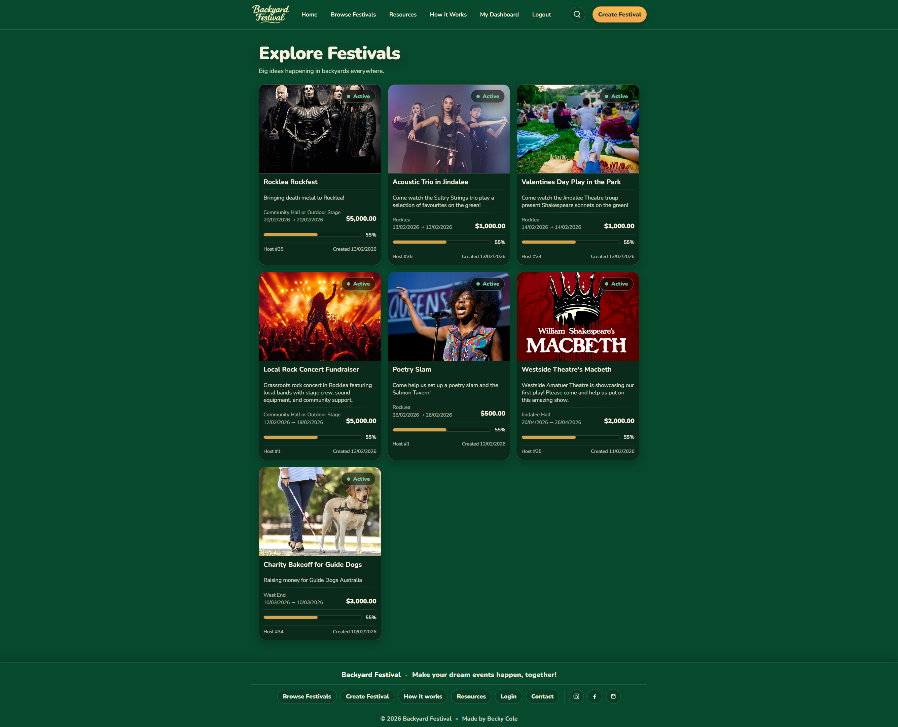

### Festival with Pledges and Rewards


### Unauthorised Edit Attempt  
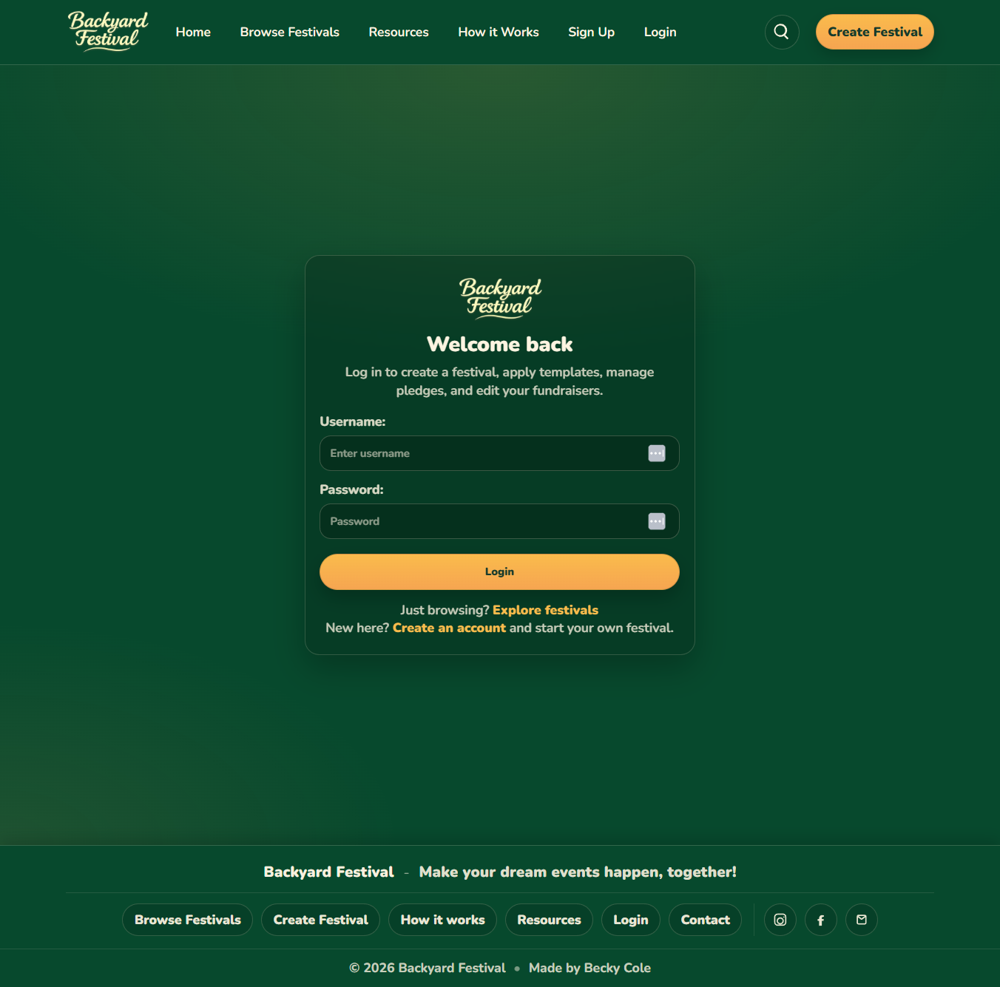

### Dashboard Supporter View
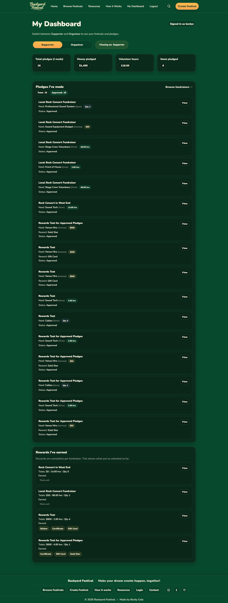

### Dashboard Owner View
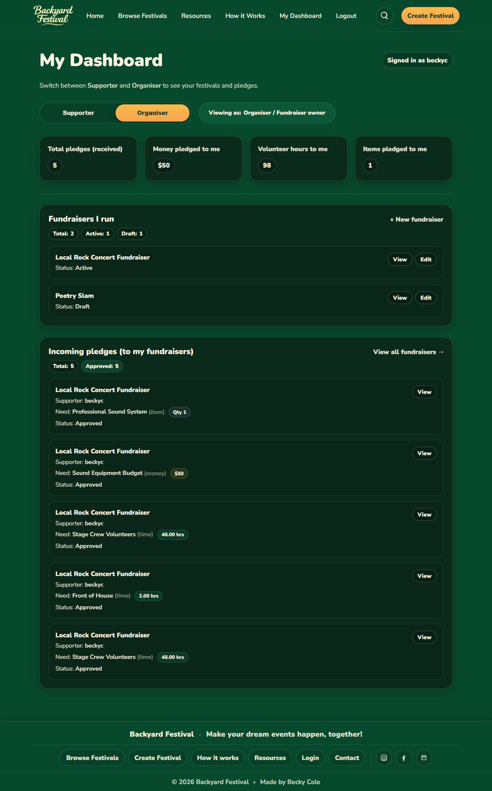

### Add Money/Time/Item Rewards
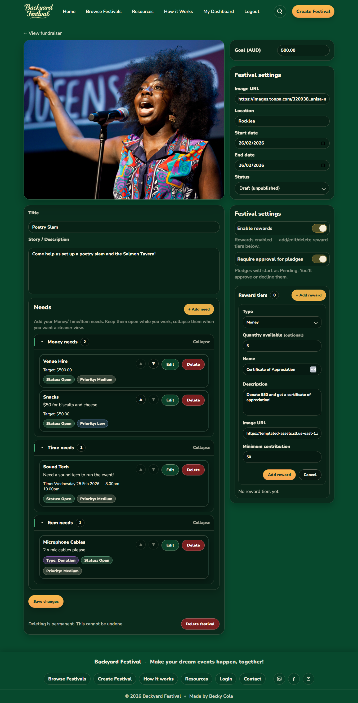

## Add Money/Time/Item Needs
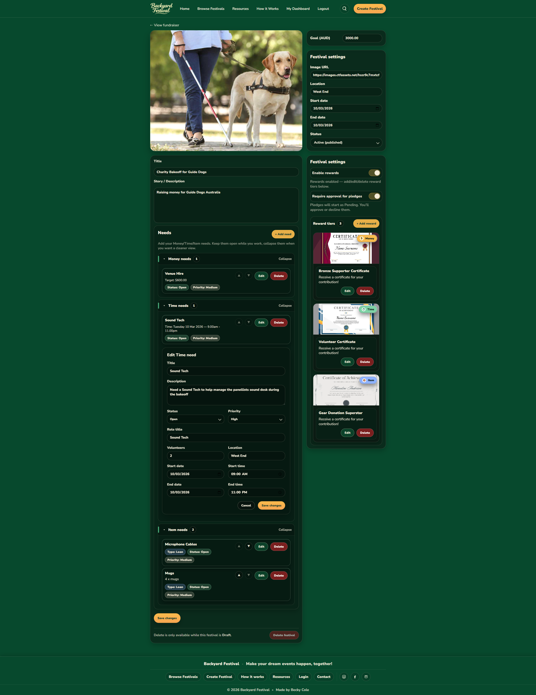

## Edit Money/Time/Item Needs
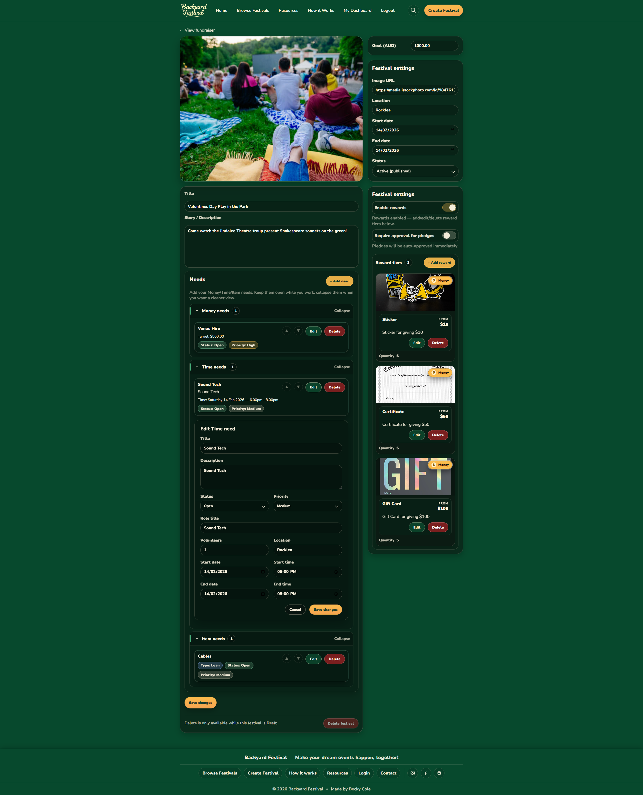

## 404 Page
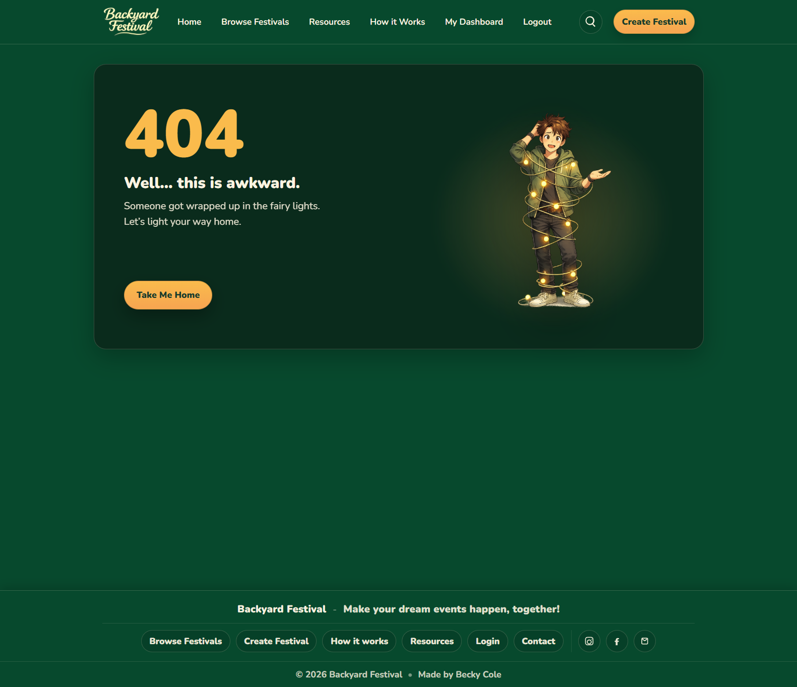

# How it Works Page
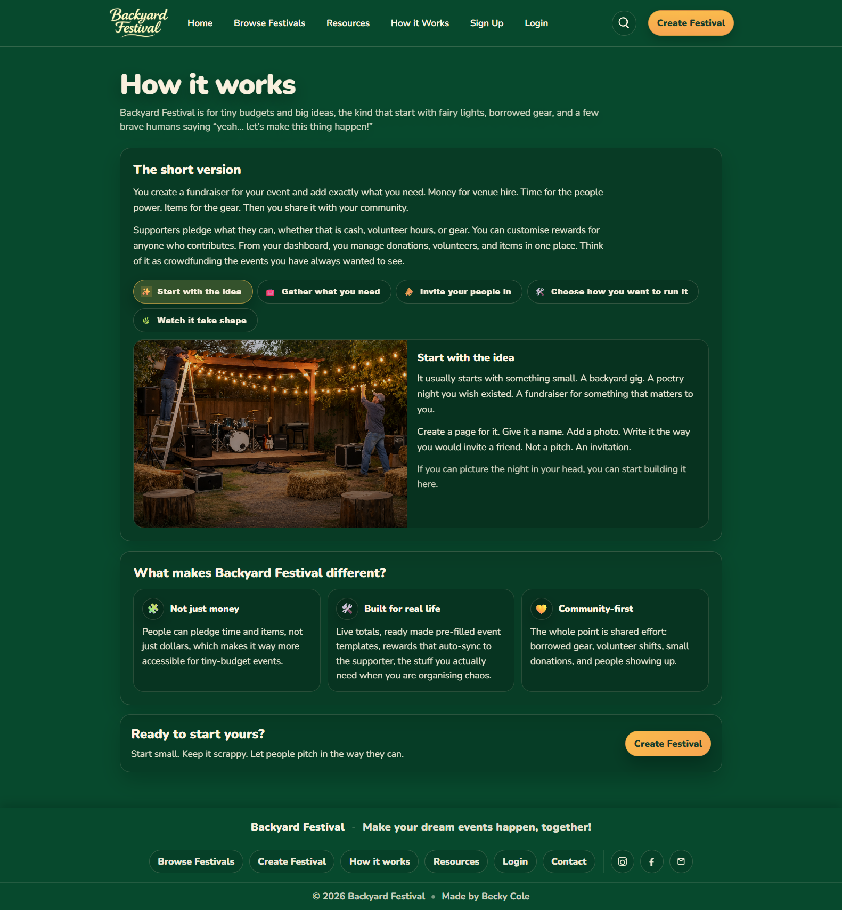

# Resources Page
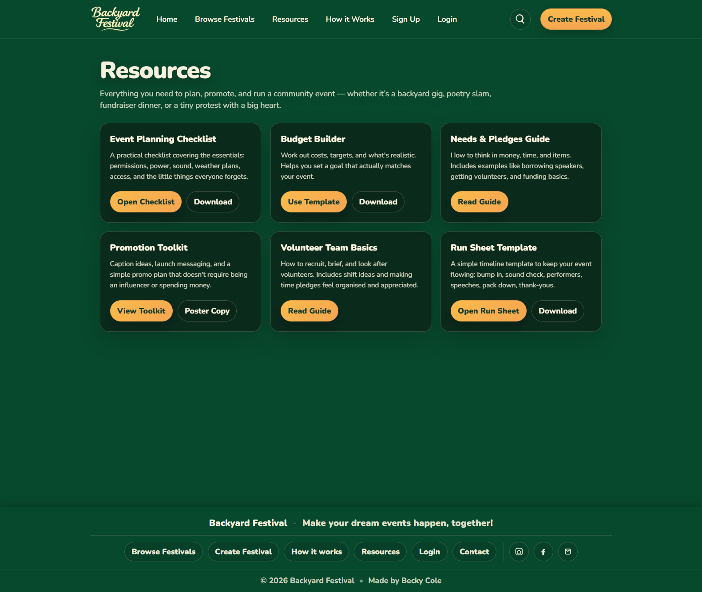
---

## 🚀 Running Locally

### Backend

```bash
python manage.py migrate
python manage.py runserver
```

### Frontend

```bash
npm install
npm run dev
```

## Unique Value Proposition

Backyard Festival expands traditional crowdfunding by:
- Supporting money, time, and item pledges
- Providing dual approval workflows
- Automatically closing fulfilled needs
- Supporting reusable templates
- Providing role-based dashboards
- Dynamically accumulating reward tiers
- Reflecting real-world grassroots collaboration

## Project Requirements
This section maps the key course requirements to Backyard Festival functionality.

- Separate backend API (DRF) and frontend (React)
- Clear target audience
- User accounts (username, email, password)
- Fundraiser creation (title, owner, description, image, target, open/closed, created date)
- Pledging system (amount, fundraiser, supporter, anonymous, comment)
- Update and delete functionality with permissions
- Suitable permissions (owner-only actions, organiser moderation)
- Appropriate API status codes for success and failure cases
- Custom 404 page in React
- Token Authentication with endpoint returning token and user
- Responsive design across key pages
  
## Challenges and Learnings
Some of the biggest learning wins in this project were:

- Designing a relational model that supports three pledge types and three need types
- Implementing two approval workflows while keeping totals accurate
- Keeping the UI responsive while supporting role-based rendering
- Building “real-world logic,” for example, filled needs, pending pledges, and auto-closure
- Ensuring permissions and visibility rules are enforced on both frontend and backend

## Reflection
Backyard Festival demonstrates full-stack development skills across both backend and frontend, with workflow logic that mirrors real event planning. I based the entire site off running events at CHYFM where sourcing money, borrowing items and coordinating volunteers was a daily part of the job. 

The biggest goal of the project was to build a platform that feels practical for grassroots organisers, where people can contribute in the ways that community events actually run, money, time, and shared resources. The most important thing for me is that it reflected a real life need with user functionality that actually mattered. 

This project strengthened my understanding of building relational systems, permissions, and dynamic UI updates driven by real application state.

## Appendix - Course Submission Requirements 

## Project Requirements
Here's a reminder of the required features. Your crowdfunding project must:

- [ ] Be separated into two distinct projects: an API built using the Django Rest Framework and a website built using React. 
- [ ] Have a cool name, bonus points if it includes a pun and/or missing vowels. See https://namelix.com/ for inspiration. <sup><sup>(Bonus Points are meaningless)</sup></sup>
- [ ] Have a clear target audience.
- [ ] Have user accounts. A user should have at least the following attributes:
  - [ ] Username
  - [ ] Email address
  - [ ] Password
- [ ] Ability to create a “fundraiser” to be crowdfunded which will include at least the following attributes:
  - [ ] Title
  - [ ] Owner (a user)
  - [ ] Description
  - [ ] Image
  - [ ] Target amount to raise
  - [ ] Whether it is currently open to accepting new supporters or not
  - [ ] When the fundraiser was created
- [ ] Ability to “pledge” to a fundraiser. A pledge should include at least the following attributes:
  - [ ] An amount
  - [ ] The fundraiser the pledge is for
  - [ ] The supporter/user (i.e. who created the pledge)
  - [ ] Whether the pledge is anonymous or not
  - [ ] A comment to go along with the pledge
- [ ] Implement suitable update/delete functionality, e.g. should a fundraiser owner be allowed to update its description?
- [ ] Implement suitable permissions, e.g. who is allowed to delete a pledge?
- [ ] Return the relevant status codes for both successful and unsuccessful requests to the API.
- [ ] Handle failed requests gracefully (e.g. you should have a custom 404 page rather than the default error page).
- [ ] Use Token Authentication, including an endpoint to obtain a token along with the current user's details.
- [ ] Implement responsive design.

## Additional Notes
No additional libraries or frameworks, other than what we use in class, are allowed unless approved by the Lead Mentor.

Note that while this is a crowdfunding website, actual money transactions are out of scope for this project.

## Submission
To submit, fill out [this Google form](https://forms.gle/34ymxgPhdT8YXDgF6), including a link to your Github repo. Your lead mentor will respond with any feedback they can offer, and you can approach the mentoring team if you would like help to make improvements based on this feedback!

Please include the following in your readme doc:
- [x] A link to the deployed project.
- [x] A screenshot of the homepage
- [x] A screenshot of the fundraiser creation page
- [x] A screenshot of the fundraiser creation form
- [x] A screenshot of a fundraiser with pledges
- [x] A screenshot of the resulting page when an unauthorized user attempts to edit a fundraiser (optional, depending on whether or not this functionality makes sense in your app!)


